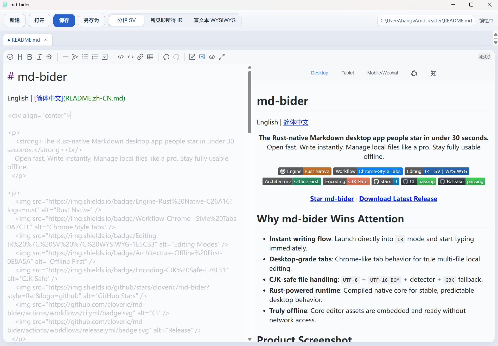

# md-bider (马得笔)

English | [简体中文](README.zh-CN.md)

<div align="center">
  

  <p>
    <strong>The Rust-native Markdown desktop app people star in under 30 seconds.</strong><br/>
    Open fast. Write instantly. Manage local files like a pro. Stay fully usable offline.
  </p>

  <p>
    
    
    
    
    
    
    
    
  </p>

  <p>
    <a href="https://github.com/cloveric/md-bider/stargazers"><strong>Star md-bider</strong></a> ·
    <a href="https://github.com/cloveric/md-bider/releases/latest"><strong>Download Latest Release</strong></a>
  </p>
</div>

<div align="center">
  
  <p><strong>md-bider (马得笔): a lightweight but powerful Markdown browser and editor.</strong></p>
</div>

## Why md-bider Wins Attention

- **Instant writing flow**: Launch directly into `IR` mode and start typing immediately.
- **Desktop-grade tabs**: Chrome-like tab behavior for true multi-file local editing.
- **CJK-safe file handling**: `UTF-8` + `UTF-16 BOM` + detector + `GBK` fallback.
- **Rust-powered runtime**: Compiled native core for stable, predictable desktop behavior.
- **Truly offline**: Core editor assets are embedded and ready without network access.

## Product Screenshot

<div align="center">
  
</div>

## md-bider vs Typical Markdown Editors

| Dimension | Typical Experience | md-bider |
| --- | --- | --- |
| Time-to-first-word | Setup first, writing later | Open and write instantly |
| Local multi-file work | Single-document oriented | Native tabbed workflow |
| CJK/legacy encoding | UTF-8 only in many cases | UTF-16 BOM + detect + GBK fallback |
| Offline confidence | Plugin/network dependency risk | Embedded assets, offline-ready |
| Desktop architecture | Browser-shell-first pattern | Rust-native shell + local-first IO |

## Why Rust Is a Real Product Advantage

md-bider is not "web app in disguise." It uses a Rust desktop shell (`tao + wry`) with local file IO and deterministic command/event boundaries. The practical result is lower runtime friction, cleaner packaging, and dependable behavior on real desktop workflows.

## Feature Set

| Capability | Details |
| --- | --- |
| Editing modes | `IR`, `SV`, `WYSIWYG` |
| Tabbed workflow | Create, switch, and close multiple local markdown files |
| File operations | New, open, save, save as |
| Keyboard shortcuts | `Ctrl+N / Ctrl+O / Ctrl+S / Ctrl+Shift+S / Ctrl+W` |
| CLI opening | `md-bider.exe <file.md>` |
| Offline runtime | JS/CSS/i18n assets embedded in binary |

## Get md-bider

- Releases: <https://github.com/cloveric/md-bider/releases/latest>
- Windows package: `md-bider-vX.Y.Z-windows-x64.zip` -> run `md-bider.exe`
- macOS package: `md-bider-vX.Y.Z-macos-*.zip` -> drag `md-bider.app` into `Applications`

## Build From Source

```powershell
git clone https://github.com/cloveric/md-bider.git
cd md-bider
cargo build --release
```

- Windows: `./target/release/md-bider.exe`
- macOS: `./target/release/md-bider`

## Project Story

md-bider started with one clear goal: make local markdown editing feel immediate, reliable, and satisfying. If your workflow is file-first, offline-capable, and speed-sensitive, md-bider is built for exactly that.

## Contributing

Issues and PRs are welcome. See [CONTRIBUTING.md](CONTRIBUTING.md) and [CHANGELOG.md](CHANGELOG.md).

## License

MIT
